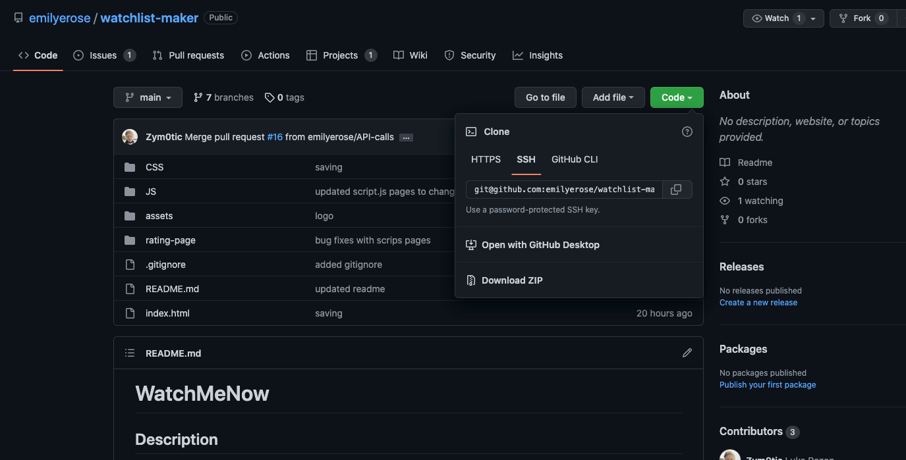
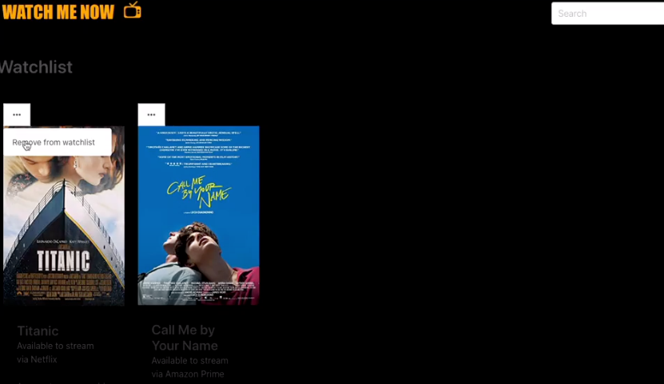
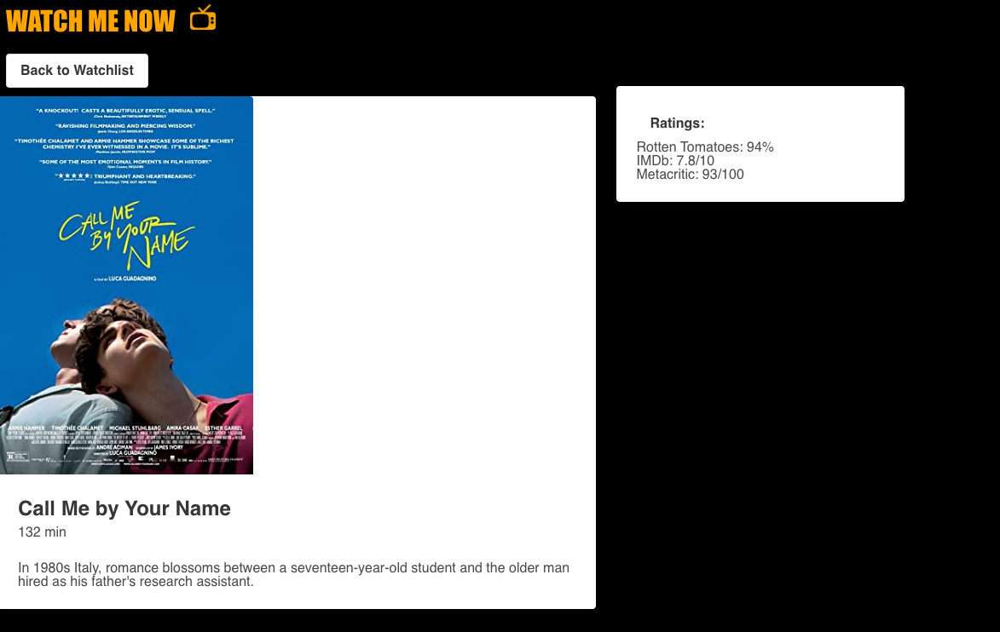

# Watch Me Now

## Description
When searching for films to watch, it is often difficult to find what streaming services it is currently on. We wanted an app to combine IMDB, Rotten Tomatoes score, and the ability to add to watchlist to keep track of all movies a user wants to see and the option to rate it once watched.

When I go to the homepage, I see my watchlist and have the choice to click on different movies added to it and see on what streaming websites it is available. When I click on the search bar, I can search for any movie and am presented with the ability to rate it, see what streaming services it is on, its Rotten Tomatoes and IMDB rating, and film description. 

## Installation
Go to <a> https://github.com/emilyerose/watchlist-maker </a>.
Click on Code and copy the SSH key to pull from git. 

## Usage

## Credits
Emily Rose- <a> https://github.com/emilyerose </a>
Worked with javascript and API calls.

Lucas Rozon- <a> https://github.com/Zym0tic </a>
Worked on HTML, CSS, and Bulma, javascript for homepage.

Juliet Lamond- <a> https://github.com/jlamond37 </a>
Worked on the design, HTML, CSS, javascript, and Bulma for the rating web page.

